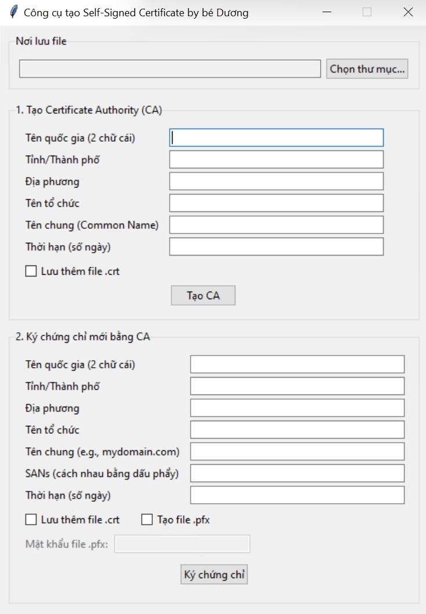

# Công cụ tạo Self-Signed Certificate (GUI)

Đây là một công cụ đơn giản với giao diện đồ họa (GUI) được xây dựng bằng Python, giúp bạn dễ dàng tạo Certificate Authority (CA) gốc và ký các chứng chỉ (certificate) cho mục đích phát triển, kiểm thử hoặc sử dụng trong môi trường nội bộ.

Công cụ được đóng gói thành một file `.exe` duy nhất, không cần cài đặt Python hay bất kỳ thư viện nào khác.

## ✨ Tính năng chính

* **Giao diện đồ họa trực quan:** Dễ dàng thao tác và nhập liệu mà không cần dùng dòng lệnh.
* **Tạo Root CA:** Nhanh chóng tạo ra một Certificate Authority gốc để tự quản lý chứng chỉ.
* **Ký chứng chỉ:** Sử dụng CA đã tạo để ký và cấp phát chứng chỉ cho máy chủ hoặc người dùng.
* **Hỗ trợ SAN:** Cho phép nhập nhiều **Subject Alternative Name** (bao gồm cả DNS name và địa chỉ IP), một yêu cầu quan trọng cho các trình duyệt hiện đại.
* **Nhiều định dạng đầu ra:**
    * Xuất chứng chỉ và khóa riêng tư dưới định dạng **PEM** (`.pem`).
    * Tùy chọn xuất chứng chỉ dưới định dạng **CRT** (`.crt`) để tương thích tốt hơn với Windows.
    * Tùy chọn xuất ra file **PFX/PKCS#12** (`.pfx`) được bảo vệ bằng mật khẩu, gộp cả khóa riêng tư và chứng chỉ vào một file duy nhất.
* **Tùy chọn thư mục lưu trữ:** Cho phép người dùng chọn chính xác nơi lưu các file được tạo ra.
* **Độc lập:** Được đóng gói thành file `.exe`, chạy ngay không cần cài đặt.

---

## 🚀 Cách sử dụng

1.  Truy cập vào trang **[Releases](https://github.com/trungduongmewmew/Cert-Generator/)** của repository này.
2.  Tải về file `.exe` 
3.  Chạy file `.exe` vừa tải về. Giao diện chương trình sẽ hiện lên và bạn có thể bắt đầu sử dụng.

---

## 📖 Hướng dẫn chi tiết

### Bước 1: Tạo Certificate Authority (CA)

Đây là bước đầu tiên và quan trọng nhất, bạn cần có một CA để ký các chứng chỉ khác.

1.  **Chọn nơi lưu file:** Nhấn nút `Chọn thư mục...` và chọn một thư mục trống để lưu tất cả các file sẽ được tạo ra.
2.  **Điền thông tin CA:** Điền các thông tin cho CA của bạn vào các trường trong khung **"1. Tạo Certificate Authority (CA)"**.
3.  **(Tùy chọn) Lưu file .crt:** Tick vào ô `Lưu thêm file .crt` nếu bạn muốn có thêm file `ca_certificate.crt`.
4.  **Tạo CA:** Nhấn nút `Tạo CA`.
5.  **Kết quả:** Chương trình sẽ tạo ra các file trong thư mục bạn đã chọn:
    * `ca_private_key.pem`: Khóa riêng tư của CA. **(CỰC KỲ BẢO MẬT)**
    * `ca_certificate.pem`: Chứng chỉ công khai của CA.
    * `ca_certificate.crt`: (Nếu bạn đã chọn)

### Bước 2: Ký một chứng chỉ mới

Sau khi đã có CA, bạn có thể dùng nó để ký nhiều chứng chỉ cho các dịch vụ khác nhau (web server, database,...).

1.  **Điền thông tin chứng chỉ:** Điền thông tin cho chứng chỉ mới vào các trường trong khung **"2. Ký chứng chỉ mới bằng CA"**.
    * **Tên chung (Common Name):** Thường là tên miền chính, ví dụ `localhost`, `mydomain.com`.
    * **SANs:** Nhập các tên miền hoặc địa chỉ IP khác, **cách nhau bằng dấu phẩy**. Ví dụ: `www.mydomain.com, api.domain.com, 192.168.1.10`.
2.  **Chọn định dạng xuất:**
    * Tick `Lưu thêm file .crt` nếu bạn cần file `.crt` cho chứng chỉ này.
    * Tick `Tạo file .pfx` nếu bạn cần file PFX. Khi đó, ô nhập **mật khẩu** sẽ hiện ra, bạn cần đặt mật khẩu cho file.
3.  **Ký chứng chỉ:** Nhấn nút `Ký chứng chỉ`.
4.  **Kết quả:** Chương trình sẽ tạo thêm các file mới trong cùng thư mục đã chọn:
    * `certificate_private_key.pem`: Khóa riêng tư của chứng chỉ.
    * `certificate.pem`: Chứng chỉ công khai.
    * `certificate.crt`: (Nếu bạn đã chọn)
    * `certificate.pfx`: (Nếu bạn đã chọn)

---

## 🛠️ Công nghệ sử dụng

* **Python 3**
* **Tkinter** cho giao diện đồ họa.
* **Cryptography** cho các tác vụ xử lý mã hóa và tạo chứng chỉ.
* **PyInstaller** để đóng gói thành file `.exe`.

---

## 📄 Giấy phép

Dự án này được cấp phép dưới Giấy phép MIT. Xem file `LICENSE` để biết thêm chi tiết.

---

## 💬 Phản hồi & Đóng góp

Nếu bạn gặp lỗi hoặc có ý tưởng cải tiến, đừng ngần ngại tạo một **[Issue](https://github.com/your-username/your-repository/issues)** trên repository này. Mọi đóng góp đều được chào đón!